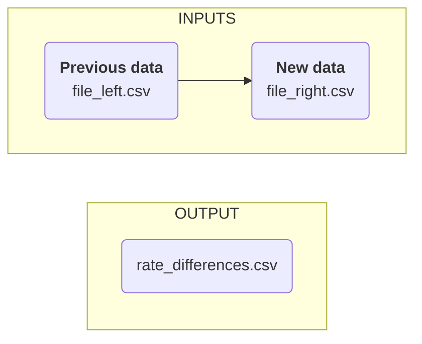

# Project `ai-reality-check`

# Agent to Compare Files: `Intel RateDiff`

## Purpose
The `Intel RateDiff` is a custom-built tool designed to streamline the comparison of rate data across CSV files, with a focus on clarity and actionable insights. This functionality is particularly useful for projects like `Intel Rates`, where rate integrity and change tracking are critical.

Disclaimer: Copilot likes to be creative and may produce accurate or inaccurte, relevant or irrelevant text to accopmany the output file.  Regardless of output consistency issues, the focus of this agent is to produce an accurate output data file.  

## Functionality
The agent is designed to:
- Compare two CSV files containing rate data.
- Identify differences such as new entries, removed entries, and changes in rate values.
- Output a merged CSV file that includes an additional column explaining the differences between the two datasets.
  
You need to understand how to get results in `rate_differences.csv` and 
[How to interpret column `_merge`](#how-to-interpret-column-_merge))

## Value
Instead of manually comparing two long files, you get a short summary of rows with differences.

## How to use
- Start `Intel RateDiff` agent  
- Add your 2 files to the prompt.  Your files can have any name, but think of them in order from older to newer,  
  from left to right as `file_left.csv` and `file_right.csv`  
- Wait for Copilot to do what it does, and 
- Downloaded an output file named `rate_differences.csv`

You need to understand how to get and interpret results in `rate_differences.csv`  

Steps:  
- Open file `rate_differences.csv`  
- Enable filter by column headers  
- Filter out `_merge` column by values: `left_only` and `right_only`. 
- The resulting rows are the differences between the two files

## How to interpret column `_merge`: 

The `_merge` column in the `rate_differences.csv` file indicates the source of each row in the merged dataset. Here's how to interpret the values in the _merge column: 

- `left_only`: These rows are present only `file_left.csv` and not in `file_right.csv`. These are considered deleted rows. 

- `right_only`: These rows are present only in `file_right.csv` and not in `file_left.csv`. These are considered new rows. 

- note: explain modified rows (if so far so good)
